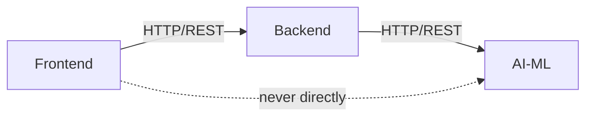

# CreditOps AI — Implementation Phases

> 3 tracks. 65 sub-phases. Each sub-phase = 1 focused session.

---

## Project Structure (After Restructuring)

```
Finance-Credit-Follow-Up-Email-Agent/   (root — monorepo)
├── ai-ml/                ← All existing Python agent code (moved here)
│   ├── src/              ← agent.py, tools.py, triage.py, emailer.py, etc.
│   ├── prompts/          ← email_prompt.py (tone escalation templates)
│   ├── test/             ← 13 existing test files
│   ├── Dataset/          ← Data_Ingestion.csv
│   ├── outputs/          ← run reports, DLQ, audit logs
│   ├── main.py           ← CLI entry point
│   ├── dashboard.py      ← Streamlit dashboard
│   └── requirements.txt
├── backend/              ← TypeScript API server (initialized, empty)
│   ├── src/index.ts
│   ├── package.json
│   └── tsconfig.json
├── frontend/             ← React + TypeScript + Vite (scaffolded)
│   ├── src/
│   ├── package.json
│   └── vite.config.ts
├── implementation_plan/  ← This file + product_vision.md
├── README.md
└── .gitignore
```

---

## Dependency Rules (Loose Coupling)



- **Frontend → Backend**: REST API calls only. Frontend never talks to AI-ML directly.
- **Backend → AI-ML**: REST API calls to the AI-ML service. Backend never imports Python code.
- **Frontend → AI-ML**: Never. Always routed through Backend.
- **Each track has its own**: `package.json` / `requirements.txt`, env config, test suite, and can be deployed independently.

---

## Track Overview

| Track | Sub-Phases | Focus |
|---|---|---|
| **Phase A — Backend** | A1 → A25 | TypeScript API: DB, auth, invoices, comms, integrations, analytics |
| **Phase B — Frontend** | B1 → B22 | React dashboard: auth, invoices, agents, analytics, settings |
| **Phase C — AI-ML** | C1 → C18 | Python agents: DB migration, API wrapper, multi-channel, risk, multi-agent |

---

# Phase A — Backend (TypeScript)

> Tech: Express/Hono + Drizzle ORM + PostgreSQL + Redis + JWT

---

### A1 — Project Bootstrap & Dev Tooling
**Goal**: Working TypeScript backend that starts, compiles, and has linting.
- Install core deps: `express` (or `hono`), `typescript`, `tsx`, `vitest`, `eslint`
- Configure `tsconfig.json` path aliases
- Create folder structure: `src/{routes, services, db, middleware, types, utils}`
- Add a health check route `GET /api/health` → `{ status: "ok", timestamp }`
- Verify: `npm run dev` starts, `curl localhost:3001/api/health` returns 200

### A2 — Database Schema Design & ORM Setup
**Goal**: PostgreSQL connected via Drizzle ORM with initial schema.
- Install `drizzle-orm`, `drizzle-kit`, `pg` (postgres driver)
- Design schema tables:
  - `tenants` (id, name, slug, created_at)
  - `users` (id, tenant_id, email, password_hash, role, created_at)
  - `invoices` (id, tenant_id, invoice_no, client_name, invoice_amount, due_date, contact_email, payment_status, followup_count, last_followup_date, days_overdue, urgency_tier, created_at, updated_at)
  - `communications` (id, invoice_id, channel, subject, body, status, sent_at, opened_at, clicked_at, error)
  - `events` (id, invoice_id, event_type, payload, created_at)
- Create `drizzle.config.ts` pointing to local PostgreSQL
- Generate and run initial migration
- Verify: tables exist in DB via `drizzle-kit studio`

### A3 — Environment & Configuration Module
**Goal**: Centralized, typed config loading.
- Create `src/config.ts` using `dotenv` + Zod validation
- Define schema: `DATABASE_URL`, `JWT_SECRET`, `PORT`, `AI_ML_SERVICE_URL`, `REDIS_URL`, `CORS_ORIGINS`
- Create `.env.example` with all required variables
- Validate config on startup — crash with clear error if missing
- Verify: app refuses to start with missing `DATABASE_URL`

### A4 — Authentication — Register & Login
**Goal**: JWT-based auth with password hashing.
- Install `bcryptjs`, `jsonwebtoken`
- Create `POST /api/auth/register` → hash password, insert user, return JWT
- Create `POST /api/auth/login` → verify password, return JWT
- Create `src/middleware/auth.ts` — extract & verify JWT from `Authorization: Bearer` header
- Create `src/types/auth.ts` — `AuthenticatedRequest` type extending Express Request
- Verify: register → login → use token on protected route

### A5 — Authentication — Middleware & Token Refresh
**Goal**: Protect all routes, handle token expiry.
- Create `authRequired` middleware that rejects 401 if no valid token
- Create `POST /api/auth/refresh` → issue new token if current one is < 7d old
- Create `GET /api/auth/me` → return current user profile
- Add role field to JWT payload (`admin`, `manager`, `viewer`)
- Verify: expired token returns 401, refresh returns new token

### A6 — Tenant Management
**Goal**: Multi-tenancy isolation.
- Create `POST /api/tenants` → create new tenant (admin only)
- Create `GET /api/tenants/:id` → get tenant details
- Create `tenantScoped` middleware — injects `tenant_id` from JWT into every query
- All subsequent queries automatically filter by `tenant_id`
- Verify: user from Tenant A cannot see Tenant B's data

### A7 — Invoices CRUD — Create & List
**Goal**: Core invoice endpoints.
- `POST /api/invoices` → create single invoice (validate with Zod)
- `POST /api/invoices/bulk` → create multiple invoices from array
- `GET /api/invoices` → list with pagination (`page`, `limit`, `sort_by`, `order`)
- Add filters: `status`, `urgency_tier`, `days_overdue_min`, `days_overdue_max`, `client_name`
- Calculate `days_overdue` dynamically on read (like current `data_loader.py`)
- Verify: create 10 invoices, paginate, filter by status

### A8 — Invoices CRUD — Read, Update, Delete
**Goal**: Complete invoice lifecycle.
- `GET /api/invoices/:id` → single invoice with full details
- `PATCH /api/invoices/:id` → update specific fields (payment_status, contact_email, etc.)
- `DELETE /api/invoices/:id` → soft delete (set `deleted_at`)
- `PATCH /api/invoices/:id/status` → dedicated status update endpoint (Pending → Paid → Written Off)
- Verify: update invoice status, confirm `days_overdue` recalculates

### A9 — Invoice Import — CSV Upload
**Goal**: Let users upload CSV files (replacing manual file editing).
- `POST /api/invoices/import` → accept `multipart/form-data` with CSV file
- Parse CSV with `papaparse`, validate each row with Zod
- Return `{ imported: N, skipped: N, errors: [...] }`
- Handle duplicates: if `invoice_no` already exists for this tenant, skip or update
- Verify: upload the existing `Data_Ingestion.csv` → see 10 invoices created

### A10 — Triage Engine (Backend Port)
**Goal**: Port the Python triage logic to TypeScript.
- Create `src/services/triage.ts`
- Implement the 5-stage urgency matrix matching `ai-ml/src/triage.py`:
  - 1-7 days → `stage_1_warm`
  - 8-14 days → `stage_2_firm`
  - 15-21 days → `stage_3_serious`
  - 22-30 days → `stage_4_stern`
  - 30+ days → `legal_escalation`
- `GET /api/invoices/triaged` → returns invoices sorted by urgency with tier assigned
- Auto-update `urgency_tier` column on every read
- Verify: invoices return correct tiers matching Python implementation

### A11 — Communications Log
**Goal**: Track all outbound communications per invoice.
- `GET /api/invoices/:id/communications` → list all emails/SMS sent for this invoice
- `POST /api/communications` → internal endpoint to log a sent communication
- Schema: `channel` (email/sms/whatsapp), `subject`, `body_preview`, `status` (sent/failed/dry_run), `sent_at`
- Verify: create communication records, query by invoice

### A12 — Event Timeline
**Goal**: Full audit trail per invoice (like current `logger.py`).
- `GET /api/invoices/:id/timeline` → ordered list of all events
- Event types: `created`, `triage_assigned`, `email_generated`, `email_sent`, `email_opened`, `status_changed`, `payment_received`, `escalated`, `halted`
- Each event stores: `event_type`, `payload` (JSON), `created_at`, `actor` (user or "system")
- Create helper `emitEvent(invoiceId, type, payload)` used by all services
- Verify: create invoice → triage → see timeline with 2 events

### A13 — AI-ML Service Bridge
**Goal**: Backend can call the AI-ML Python service via HTTP.
- Create `src/services/aiml-client.ts`
- Methods:
  - `triggerFollowup(invoiceData)` → ask AI-ML to generate + send email for this invoice
  - `getAgentStatus()` → check if AI-ML service is healthy
  - `triggerBatchRun(invoiceIds)` → trigger batch processing
- Handle timeouts, retries, circuit breaker pattern
- Verify: mock AI-ML server responds to health check

### A14 — Agent Run Management
**Goal**: Trigger and track agent runs from the backend.
- `POST /api/agent/run` → trigger a new collection run (calls AI-ML service)
- `GET /api/agent/runs` → list past runs with results (from events table)
- `GET /api/agent/runs/:id` → details of a specific run
- `POST /api/agent/run/invoice/:id` → trigger follow-up for a single invoice
- Store run metadata: start_time, end_time, invoices_processed, emails_sent, errors
- Verify: trigger run, see it logged with results

### A15 — Dead Letter Queue API
**Goal**: Expose DLQ data (port of `dead_letter.py`).
- Create `dlq_entries` table: `invoice_id`, `consecutive_failures`, `last_error`, `first_failure`, `last_failure`
- `GET /api/dlq` → list all DLQ entries sorted by failure count
- `DELETE /api/dlq/:invoice_id` → manually clear a DLQ entry (retry)
- `GET /api/dlq/stats` → `{ total: N, critical: N (>=3 failures) }`
- Verify: create DLQ entries, query, clear

### A16 — Email Configuration & SendGrid Integration
**Goal**: Configurable email sending via SendGrid API (replacing raw SMTP).
- Create `src/services/email.ts`
- Support two modes: `dry_run` (log only) and `live` (SendGrid API)
- `POST /api/settings/email/test` → send a test email to verify config
- Store email config per tenant: sender_name, sender_email, reply_to
- Track delivery status via SendGrid Event Webhooks (later phase)
- Verify: send test email in dry_run mode, confirm log output

### A17 — Idempotency Guard (Backend Port)
**Goal**: Port the 20-hour idempotency window to backend.
- Create `src/services/idempotency.ts`
- Before sending any communication, check `communications` table:
  - If same invoice was emailed within last 20 hours → skip
- Return `{ skipped: true, reason: "sent 4h ago", last_sent_at }`
- Configurable window per tenant (default 20h)
- Verify: send email → try again within 20h → get skipped

### A18 — Reconciler (Backend Port)
**Goal**: Cross-reference followup_count with actual sends.
- Create `src/services/reconciler.ts`
- `POST /api/invoices/reconcile` → compare `followup_count` in invoices table vs count of successful communications
- Auto-correct mismatches (like current `reconciler.py`)
- Return `{ checked: N, mismatches: N, corrections: [...] }`
- Verify: artificially mismatch a count, run reconciler, confirm fix

### A19 — Webhook Receiver — Payment Gateways
**Goal**: Auto-detect payments from Stripe/Razorpay.
- `POST /api/webhooks/stripe` → handle `payment_intent.succeeded` event
- `POST /api/webhooks/razorpay` → handle `payment.captured` event
- Match payment to invoice via `metadata.invoice_id` or amount+email lookup
- On match: update `payment_status` to "Paid", emit `payment_received` event, cancel pending follow-ups
- Verify: simulate Stripe webhook → invoice marked as Paid

### A20 — Webhook Receiver — Email Events (SendGrid)
**Goal**: Track email opens, clicks, bounces.
- `POST /api/webhooks/sendgrid` → handle delivery, open, click, bounce events
- Update `communications` table: `opened_at`, `clicked_at`, `bounced_at`
- Emit events: `email_opened`, `email_clicked`, `email_bounced`
- Verify: simulate open webhook → communication record updated

### A21 — Analytics Engine — Core Metrics
**Goal**: Business intelligence endpoints.
- `GET /api/analytics/summary` → total receivable, total collected, total overdue, invoice count
- `GET /api/analytics/aging` → aging bucket breakdown (matching triage tiers)
- `GET /api/analytics/dso` → Days Sales Outstanding calculation
- `GET /api/analytics/collection-rate` → % of invoices collected on time
- All filtered by date range (`from`, `to`) and tenant-scoped
- Verify: create sample data, confirm DSO calculation is accurate

### A22 — Analytics Engine — Agent Performance
**Goal**: Measure how well the AI agent performs.
- `GET /api/analytics/agent/performance` → emails sent, success rate, avg time-to-payment
- `GET /api/analytics/agent/channel-breakdown` → performance per channel (email, sms, whatsapp)
- `GET /api/analytics/agent/tier-effectiveness` → which tone tier leads to fastest payment
- Verify: create run history, query performance metrics

### A23 — Settings & Tenant Configuration
**Goal**: Per-tenant settings management.
- `GET /api/settings` → current tenant settings
- `PATCH /api/settings` → update settings
- Settings: company_name, sender_name, sender_email, payment_link, bank_details, timezone, schedule_hour, dry_run, idempotency_window_hours
- `GET /api/settings/integrations` → list configured integrations with status
- Verify: update setting → next agent run uses new value

### A24 — Rate Limiting & API Security
**Goal**: Production-ready API security.
- Install `express-rate-limit` or use Redis-based limiter
- Rate limits: 100 req/min for standard routes, 10 req/min for auth routes
- Add request validation middleware (Zod on all inputs)
- Add CORS configuration (only allow frontend origin)
- Add request logging middleware (structured JSON logs)
- Verify: exceed rate limit → get 429 response

### A25 — Error Handling & Monitoring
**Goal**: Graceful error handling and observability.
- Create global error handler middleware with typed error classes
- Error types: `NotFoundError`, `ValidationError`, `AuthError`, `ConflictError`
- Structured error responses: `{ error: { code, message, details } }`
- Add Sentry integration for unhandled errors (optional, env-gated)
- Add request ID to every response header for tracing
- Verify: trigger each error type → confirm structured response

---

# Phase B — Frontend (React + TypeScript + Vite)

> Tech: React 18 + TypeScript + Vite + TanStack Query + React Router + Recharts

---

### B1 — Project Setup & Design System
**Goal**: Clean project structure with design tokens and reusable primitives.
- Clean Vite scaffold: remove demo code
- Install: `react-router-dom`, `@tanstack/react-query`, `axios`, `lucide-react`
- Create folder structure: `src/{pages, components, hooks, services, types, styles, layouts}`
- Create `src/styles/index.css` — design tokens (colors, spacing, typography using CSS variables)
- Import Inter font from Google Fonts
- Create reusable primitives: `Button`, `Card`, `Badge`, `Input`, `Spinner`
- Dark sidebar + white content layout skeleton
- Verify: `npm run dev` shows styled skeleton

### B2 — API Client & Auth Service
**Goal**: Type-safe API client with automatic token management.
- Create `src/services/api.ts` — Axios instance with baseURL, interceptors
- Auto-attach JWT from localStorage to every request
- On 401 response → redirect to login
- Create `src/types/api.ts` — shared types matching backend schemas
- Create `src/services/auth.ts` — `login()`, `register()`, `logout()`, `getMe()`
- Verify: API client makes authenticated requests

### B3 — Auth Pages — Login & Register
**Goal**: Working auth flow.
- Create `src/pages/Login.tsx` — email + password form with validation
- Create `src/pages/Register.tsx` — name + email + password + confirm password
- On success: store JWT, redirect to dashboard
- Create `AuthContext` provider — stores current user, provides `isAuthenticated`
- Create `ProtectedRoute` wrapper — redirects to login if not authenticated
- Premium design: centered card, gradient background, brand logo
- Verify: register → auto-login → see dashboard → refresh → still logged in

### B4 — App Layout & Navigation
**Goal**: App shell with sidebar navigation.
- Create `src/layouts/AppLayout.tsx` — dark sidebar (like current Streamlit) + white content area
- Sidebar nav items: Dashboard, Invoices, Agent, Analytics, DLQ, Settings
- Active route highlighting with animated indicator
- Top bar: breadcrumb, user avatar dropdown (profile, logout)
- Responsive: sidebar collapses to icon-only on small screens
- Verify: click nav items → routes change, active state updates

### B5 — Dashboard — Command Center (KPI Cards)
**Goal**: Real-time overview matching current Streamlit dashboard.
- Create `src/pages/Dashboard.tsx`
- 4 KPI cards (top row): Actionable Queue, Total Exposure, Recovery Rate, Critical Flags
- Fetch from `GET /api/analytics/summary`
- Use TanStack Query with 30s auto-refetch
- KPI card component: label, value, delta (up/down vs previous), subtle animation on load
- Verify: dashboard loads with real data from backend

### B6 — Dashboard — Charts (Aging Pipeline & Portfolio Mix)
**Goal**: Port the Plotly charts from Streamlit to Recharts.
- Install `recharts`
- Aging Pipeline: horizontal bar chart (5 tiers with color coding)
- Portfolio Mix: donut chart (Paid / Pending / Overdue)
- Fetch from `GET /api/analytics/aging` and `GET /api/invoices` (grouped by status)
- Responsive layout: charts side-by-side on desktop, stacked on mobile
- Verify: charts render with correct data matching Streamlit output

### B7 — Dashboard — Dispatch Performance & DLQ Summary
**Goal**: Bottom section of dashboard.
- Dispatch Performance row: Last Batch Sent, Automation Yield, Legal Flags, Stage 5 Halted
- Fetch from `GET /api/agent/runs` (latest run)
- DLQ Summary panel: warning banner if any invoices have ≥3 failures
- Mini table: Invoice, Failures, Last Error (top 5 only, with "View All" link)
- Verify: shows dispatch stats from last agent run

### B8 — Invoices Page — List View
**Goal**: Full invoice management table.
- Create `src/pages/Invoices.tsx`
- Data table with columns: Invoice No, Client, Amount, Due Date, Status, Days Overdue, Tier, Follow-ups
- Features: sortable columns, search bar, status filter pills, pagination
- Urgency tier shown as colored badge
- Row click → navigate to invoice detail
- Bulk actions toolbar: Export CSV, Trigger Follow-up
- Verify: list 50+ invoices, filter, sort, paginate

### B9 — Invoices Page — Import & Create
**Goal**: Add invoices via UI.
- "Import CSV" button → opens file upload modal with drag-and-drop zone
- Parse CSV client-side (preview first 5 rows), then POST to `/api/invoices/import`
- Show import results: `12 imported, 2 skipped (duplicates), 1 error (invalid email)`
- "Add Invoice" button → modal form: invoice_no, client_name, amount, due_date, contact_email
- Verify: upload CSV → see invoices appear in table

### B10 — Invoice Detail Page
**Goal**: Deep-dive into a single invoice.
- Create `src/pages/InvoiceDetail.tsx`
- Header: invoice_no, client_name, amount (large), status badge, urgency tier badge
- Info grid: due_date, days_overdue, contact_email, followup_count, last_followup_date
- Action buttons: "Send Follow-up Now", "Mark as Paid", "Edit", "View Communication History"
- Timeline section (events): vertical timeline showing all events (created → emailed → opened → paid)
- Verify: view invoice detail, see timeline events

### B11 — Invoice Detail — Communication History
**Goal**: Show all emails/messages sent for this invoice.
- Tab or section on invoice detail page
- List of communications: channel icon, subject, status badge, sent_at, opened_at
- Click to expand → shows full email body preview
- Send stats: open rate, click rate for this invoice
- Verify: invoice with 3 sent emails → shows all 3 with status

### B12 — Agent Page — Run Management
**Goal**: Control and monitor agent runs.
- Create `src/pages/Agent.tsx`
- "Run Now" button → triggers `POST /api/agent/run` → shows progress
- Run history table: date, invoices_processed, emails_sent, errors, duration
- Click run → expands to show per-invoice results
- Current agent status indicator: Idle / Running / Error
- Verify: trigger a run, see it appear in history

### B13 — Agent Page — Activity Feed
**Goal**: Live stream of what the agent is doing.
- Real-time or auto-polling (every 5s) activity feed
- Each entry: timestamp, invoice_no, action (email_generated, email_sent, skipped, halted), status badge
- Filters: show all / errors only / halted only
- Auto-scroll to latest, with "pause" toggle
- Verify: during agent run, feed shows live updates

### B14 — DLQ Page — Dead Letter Queue
**Goal**: Full DLQ management (port of Streamlit DLQ panel).
- Create `src/pages/DLQ.tsx`
- Warning banner: "⚠ X invoice(s) have failed ≥3 consecutive runs"
- Table: Invoice, Consecutive Failures, Last Error, First Failure, Last Failure
- Actions per row: "Retry" (clear DLQ entry + trigger follow-up), "Dismiss"
- Sorted by failure count descending
- Verify: DLQ with 3 entries, retry one, confirm it's removed

### B15 — Analytics Page — Financial Metrics
**Goal**: Business intelligence dashboard.
- Create `src/pages/Analytics.tsx`
- DSO (Days Sales Outstanding) trend line chart (last 30/90/365 days)
- Collection Rate bar chart (monthly)
- Aging pyramid — stacked bar showing amount per tier
- Total Receivable vs Total Collected area chart
- Date range picker to filter all charts
- Verify: charts render with meaningful data

### B16 — Analytics Page — Agent Performance
**Goal**: How well is the AI performing?
- Tab within Analytics page
- Emails Sent per Day (line chart)
- Success Rate by Tier (grouped bar chart)
- Average Time-to-Payment by Tier (bar chart)
- Channel Effectiveness comparison (email vs SMS vs WhatsApp) — placeholder for when multi-channel is built
- Verify: charts show data from agent runs

### B17 — Settings Page — General
**Goal**: Tenant configuration UI.
- Create `src/pages/Settings.tsx`
- Tabs: General, Email, Integrations, Team, Billing
- General tab: Company Name, Timezone, Default Currency, Dry Run toggle
- Auto-save on change with debounce
- Verify: change timezone → refetch data → confirm new timezone applies

### B18 — Settings Page — Email Configuration
**Goal**: Configure email sending.
- Email tab: Sender Name, Sender Email, Reply-To, SMTP/SendGrid toggle
- SendGrid API key input (masked)
- "Send Test Email" button → sends to current user's email
- Email preview: show how a Stage 1 email would look with current branding
- Verify: update sender name → test email shows new name

### B19 — Settings Page — Team Management
**Goal**: Invite and manage team members.
- Team tab: list of users with role badges (Admin, Manager, Viewer)
- "Invite User" → email input + role select → sends invite
- Edit role dropdown per user
- Remove user (with confirmation)
- Verify: invite user → they receive email → they can log in

### B20 — Responsive Design & Mobile Optimization
**Goal**: Dashboard works on tablets and phones.
- Sidebar → hamburger menu on mobile
- KPI cards → 2-column grid on tablet, 1-column on mobile
- Data tables → horizontal scroll with sticky first column
- Charts → full-width stacking
- Touch-friendly hit targets (48px minimum)
- Verify: test on 375px, 768px, 1024px, 1440px widths

### B21 — Loading States, Empty States & Error Boundaries
**Goal**: Polish the UX for every edge case.
- Skeleton loaders for KPI cards, tables, charts (shimmer animation)
- Empty states with illustrations: "No invoices yet — import your first CSV"
- Error boundaries with retry buttons: "Something went wrong. Retry?"
- Toast notifications for actions: "Invoice created", "Email sent", "Run started"
- 404 page with navigation back
- Verify: trigger each state, confirm graceful handling

### B22 — Dark Mode & Theme Toggle
**Goal**: Premium dark mode.
- CSS variable-based theming (light + dark)
- Toggle in top bar — persists in localStorage
- Dark mode: slate/zinc backgrounds, muted borders, bright accent colors
- All charts adapt to dark mode colors
- Verify: toggle dark mode, all components look correct

---

# Phase C — AI-ML (Python)

> Tech: FastAPI wrapper + existing LangChain/LangGraph agents + PostgreSQL client

---

### C1 — FastAPI Wrapper — Health & Structure
**Goal**: Wrap existing agent code in a FastAPI HTTP service.
- Install `fastapi`, `uvicorn`, `httpx`
- Create `ai-ml/api/` folder with `main.py`, `routes/`, `services/`
- `GET /health` → `{ status: "ok", model: "llama-3.1-8b-instant" }`
- `GET /status` → `{ is_running: false, last_run: "..." }`
- Keep existing `main.py` CLI working alongside new API server
- Verify: `uvicorn ai-ml.api.main:app` starts, health check returns 200

### C2 — FastAPI — Single Invoice Follow-up Endpoint
**Goal**: HTTP endpoint to process one invoice (wraps `process_invoice`).
- `POST /api/process-invoice` → accepts invoice JSON data
- Calls existing `process_invoice` logic internally
- Returns: `{ invoice_no, urgency_tier, email_subject, send_status, send_error }`
- Handles errors gracefully — returns structured error, never crashes
- Verify: POST invoice data → get email generated + sent (dry_run)

### C3 — FastAPI — Batch Run Endpoint
**Goal**: HTTP endpoint to trigger a full collection run.
- `POST /api/run` → accepts `{ invoice_ids: [...], dry_run: bool, limit: int }`
- Runs in background thread (returns `run_id` immediately)
- `GET /api/run/{run_id}/status` → progress + results
- Uses existing `run_agent()` logic internally
- Verify: trigger batch run, poll status, get results

### C4 — Database Adapter — Read Invoices from PostgreSQL
**Goal**: Agent reads from database instead of CSV.
- Install `psycopg2-binary` (or `asyncpg`)
- Create `ai-ml/src/db_loader.py` — same interface as `data_loader.py` but reads from PostgreSQL
- `load_invoices(db_url, tenant_id)` → returns same DataFrame shape as CSV loader
- Create config switch: `DATA_SOURCE=csv|postgres`
- When `postgres`: connect to same DB as backend, query `invoices` table
- Verify: agent runs against PostgreSQL data, same triage results as CSV

### C5 — Database Adapter — Write Back to PostgreSQL
**Goal**: Agent writes results back to database (not CSV).
- Create `ai-ml/src/db_updater.py` — same interface as `updater.py` but writes to PostgreSQL
- `update_followup(invoice_no, db_url)` → increment followup_count, set last_followup_date
- Log communications to `communications` table
- Log events to `events` table
- Verify: agent run → followup_count incremented in DB, communication logged

### C6 — Audit Logger — Database-Backed
**Goal**: Port `logger.py` to write to database events table.
- Create `ai-ml/src/db_logger.py`
- Same `log_action()` interface but inserts into `events` table
- Each action creates an event with `actor = "ai-agent"`
- Keep JSON file reporting as fallback (for backward compatibility)
- Run reports written to both DB and JSON file
- Verify: agent run → events visible in `events` table

### C7 — Idempotency — Database-Backed
**Goal**: Port idempotency guard to use database instead of scanning JSON files.
- Create `ai-ml/src/db_idempotency.py`
- Query `communications` table: `WHERE invoice_id = ? AND status IN ('sent', 'dry_run') AND sent_at > NOW() - interval '20 hours'`
- Much faster than scanning JSON report files
- Same `is_recently_sent()` interface
- Verify: send → check → returns True within window

### C8 — DLQ — Database-Backed
**Goal**: Port dead_letter.py to use database table.
- Use `dlq_entries` table from backend schema (Phase A15)
- Same `increment()`, `reset()`, `get()` interface
- Thread-safe via database transactions (no more file-level locking)
- Verify: fail invoice 3 times → DLQ entry shows 3 failures

### C9 — Reconciler — Database-Backed
**Goal**: Port reconciler to work with database.
- Query `invoices.followup_count` vs `COUNT(communications WHERE status = 'sent')`
- Single SQL query instead of scanning JSON files
- `POST /api/reconcile` endpoint on FastAPI
- Verify: mismatch detected and corrected via DB query

### C10 — Multi-Provider LLM Support
**Goal**: Replace Groq-only with multi-provider via LiteLLM.
- Install `litellm`
- Create `ai-ml/src/llm_client.py` — wraps LiteLLM
- Support providers: `groq` (default), `openai`, `anthropic`
- Config: `LLM_PROVIDER`, `LLM_MODEL`, `LLM_API_KEY`
- Automatic fallback: if primary provider fails after retries, try secondary
- Keep existing `tenacity` retry logic
- Verify: switch provider via env var → agent still generates emails

### C11 — Email Channel — SendGrid Integration
**Goal**: Replace raw SMTP with SendGrid API.
- Create `ai-ml/src/channels/email_sendgrid.py`
- Uses SendGrid Python SDK
- Includes tracking pixel for open detection
- Includes click tracking for payment links
- Returns `SendResult` with `message_id` for webhook correlation
- Dry-run mode still works (log only, no API call)
- Verify: send via SendGrid → email arrives, open tracked

### C12 — SMS Channel — Twilio
**Goal**: Add SMS as second communication channel.
- Create `ai-ml/src/channels/sms_twilio.py`
- `send_sms(to_phone, body)` → returns `SendResult`
- SMS-specific prompts: shorter (160 char), direct CTA only
- Create `ai-ml/prompts/sms_prompt.py` — one prompt per tier (much shorter than email)
- Dry-run mode: log to console
- Verify: send SMS in dry_run → see log output with correct body

### C13 — Channel Dispatcher (Unified)
**Goal**: Single dispatch interface for all channels.
- Create `ai-ml/src/channels/dispatcher.py`
- `dispatch(message, channel, invoice_data)` → routes to email/sms/whatsapp handler
- Unified `DispatchResult` dataclass (extends current `SendResult`)
- Channel selection logic: configurable per tier (e.g., Stage 1 = email, Stage 3 = email + SMS)
- Verify: dispatch to email → works, dispatch to SMS → works

### C14 — Risk Scoring — Basic Model
**Goal**: Predict payment probability per invoice.
- Create `ai-ml/src/risk/scorer.py`
- Features: `days_overdue`, `invoice_amount`, `followup_count`, `client_historical_payment_rate`
- Simple logistic regression model (scikit-learn)
- Output: `risk_score: 0.0-1.0` (1.0 = highest risk of non-payment)
- `POST /api/risk/score` → accepts invoice data, returns risk score
- For now, use rule-based scoring (actual ML model in C16)
- Verify: high days_overdue + high amount → high risk score

### C15 — Risk Scoring — Triage Integration
**Goal**: Risk score influences triage decisions.
- Modify triage to consider risk_score alongside days_overdue
- High risk + low days_overdue → escalate faster (skip warm, go to firm)
- Low risk + high days_overdue → allow longer warm period
- Configurable risk thresholds per tenant
- Store risk_score on invoice record
- Verify: same invoice gets different tier when risk score changes

### C16 — Risk Scoring — ML Model Training
**Goal**: Train actual ML model on historical data.
- Install `scikit-learn`, `joblib`
- Create training pipeline: `ai-ml/src/risk/train.py`
- Features: days_overdue, invoice_amount, followup_count, client_avg_payment_delay, email_opened (bool), num_past_invoices
- Target: `paid_within_30_days` (binary)
- Train on historical communications + invoice data
- Save model with `joblib`, load on startup
- Verify: trained model predicts better than rule-based baseline

### C17 — Multi-Agent Orchestration — Supervisor
**Goal**: Evolve from single ReAct agent to multi-agent StateGraph.
- Create `ai-ml/src/agents/supervisor.py` using LangGraph `StateGraph`
- Nodes: `triage`, `risk_score`, `select_channel`, `compose_message`, `dispatch`, `update_record`
- Conditional edges based on urgency_tier and risk_score
- `Stage 5 → halt` edge (preserves existing safety)
- Each node is a standalone function (testable independently)
- Verify: supervisor processes invoice through full graph

### C18 — Multi-Agent — Dispute & Negotiation Agents (Stub)
**Goal**: Stub out future conversational agents.
- Create `ai-ml/src/agents/dispute_agent.py` — placeholder with interface definition
- Create `ai-ml/src/agents/negotiation_agent.py` — placeholder with interface definition
- Define input/output schemas for both agents
- Add conditional edge in supervisor: `if event_type == "dispute_raised" → dispute_agent`
- Add prompts: `ai-ml/prompts/dispute_prompt.py`, `ai-ml/prompts/negotiation_prompt.py` (stubs)
- Verify: calling dispute agent returns "Not yet implemented" gracefully

---

## Execution Order (Recommended)

The three tracks can be worked on somewhat independently, but here's the optimal interleaving:

```
Week 1:   A1 → A2 → A3 → B1 → C1
Week 2:   A4 → A5 → B2 → B3 → C2
Week 3:   A6 → A7 → A8 → B4 → C3
Week 4:   A9 → A10 → B5 → B6 → C4
Week 5:   A11 → A12 → B7 → B8 → C5
Week 6:   A13 → A14 → B9 → B10 → C6
Week 7:   A15 → A16 → B11 → B12 → C7
Week 8:   A17 → A18 → B13 → B14 → C8
Week 9:   A19 → A20 → B15 → B16 → C9
Week 10:  A21 → A22 → B17 → B18 → C10
Week 11:  A23 → A24 → B19 → B20 → C11
Week 12:  A25 → B21 → B22 → C12 → C13
Week 13:  C14 → C15 → C16
Week 14:  C17 → C18
```

> [!IMPORTANT]
> **Hard dependencies** (must be completed before the dependent phase):
> - A2 (DB schema) must be done before C4 (DB adapter)
> - A4 (auth) must be done before B3 (login page)
> - A7 (invoices API) must be done before B8 (invoices list)
> - A13 (AI-ML bridge) must be done before B12 (agent page)
> - C1 (FastAPI wrapper) must be done before A13 (bridge)

> [!TIP]
> **No hard dependency required for**:
> - Frontend can use mock data until backend endpoints are ready
> - AI-ML can keep using CSV mode while DB adapters are being built
> - Backend can return mock AI-ML responses while Python service is being wrapped

---

## How We Execute

1. I present this plan → **you review and approve**
2. After approval, we go **one sub-phase at a time**
3. Each sub-phase: I implement → verify → confirm done → wait for your go-ahead
4. You can change order, skip phases, or add new ones at any time
