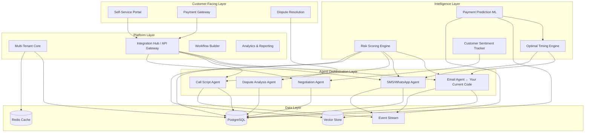
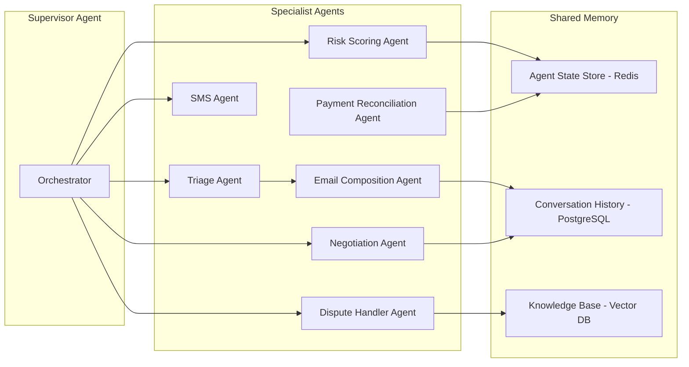

# CreditOps AI — Product Vision & Strategic Roadmap

> Evolving a single-purpose email agent into a full-scale AI-powered finance operations platform.

---

## Part 1: Current State Analysis

### What Exists Today

Your codebase is a **well-engineered single-agent system** focused on automating accounts receivable follow-up emails. Here's what I found after reading every file:

| Layer | Implementation | File(s) |
|---|---|---|
| **Orchestration** | LangGraph ReAct agent with 7 LangChain tools | [agent.py](file:///c:/Users/sures/Desktop/Finance-Credit-Follow-Up-Email-Agent/src/agent.py), [tools.py](file:///c:/Users/sures/Desktop/Finance-Credit-Follow-Up-Email-Agent/src/tools.py) |
| **LLM** | Groq (LLaMA 3.1 8B) with retry + exponential backoff | [tools.py](file:///c:/Users/sures/Desktop/Finance-Credit-Follow-Up-Email-Agent/src/tools.py#L45-L53) |
| **Triage** | 5-stage urgency matrix based on `days_overdue` | [triage.py](file:///c:/Users/sures/Desktop/Finance-Credit-Follow-Up-Email-Agent/src/triage.py) |
| **Prompt Engineering** | 4 tier-specific `ChatPromptTemplate` with persona + vocabulary rules | [email_prompt.py](file:///c:/Users/sures/Desktop/Finance-Credit-Follow-Up-Email-Agent/prompts/email_prompt.py) |
| **Email Dispatch** | SMTP with dry-run mode, MIME construction | [emailer.py](file:///c:/Users/sures/Desktop/Finance-Credit-Follow-Up-Email-Agent/src/emailer.py) |
| **Scheduling** | APScheduler with SQLAlchemy job store, timezone support, countdown UI | [scheduler.py](file:///c:/Users/sures/Desktop/Finance-Credit-Follow-Up-Email-Agent/src/scheduler.py) |
| **Data Layer** | CSV read/write with Pandas, dynamic `days_overdue` calculation | [data_loader.py](file:///c:/Users/sures/Desktop/Finance-Credit-Follow-Up-Email-Agent/src/data_loader.py) |
| **Safety** | Prompt injection sanitization, Stage 5 halt, hallucination guard, PII redaction | [tools.py](file:///c:/Users/sures/Desktop/Finance-Credit-Follow-Up-Email-Agent/src/tools.py#L125-L144), [exceptions.py](file:///c:/Users/sures/Desktop/Finance-Credit-Follow-Up-Email-Agent/src/exceptions.py) |
| **Reliability** | Idempotency guard (20h window), dead letter queue, reconciler | [idempotency.py](file:///c:/Users/sures/Desktop/Finance-Credit-Follow-Up-Email-Agent/src/idempotency.py), [dead_letter.py](file:///c:/Users/sures/Desktop/Finance-Credit-Follow-Up-Email-Agent/src/dead_letter.py), [reconciler.py](file:///c:/Users/sures/Desktop/Finance-Credit-Follow-Up-Email-Agent/src/reconciler.py) |
| **Monitoring** | Streamlit dashboard with Plotly charts, DLQ panel | [dashboard.py](file:///c:/Users/sures/Desktop/Finance-Credit-Follow-Up-Email-Agent/dashboard.py) |
| **Testing** | 13 test files covering all critical paths | [test/](file:///c:/Users/sures/Desktop/Finance-Credit-Follow-Up-Email-Agent/test) |

### What's Actually Impressive (Your Competitive DNA)

These are not throwaway features — they represent **production-grade thinking** that most student/hobby projects lack:

1. **Tone Escalation Matrix** — a 5-stage behavioural model for communication. This is a *domain model*, not just code.
2. **Reconciler** — cross-referencing CSV state against audit logs to self-heal data drift. This is the kind of thing enterprise software charges for.
3. **Dead Letter Queue** — tracking consecutive failures per invoice with alerts. This is infrastructure-grade resilience.
4. **Idempotency Guard** — preventing duplicate emails within a time window by scanning audit logs. Exactly what production billing systems need.
5. **Prompt Injection Defense** — sanitizing CSV data before it hits the LLM. Security-first mindset.
6. **Hallucination Guard** — structural validation of LLM output before dispatching.
7. **Stage 5 Halt** — hard-coded human-in-the-loop for legal escalation (3 layers of defense: agent loop, `process_invoice`, `emailer`).

### Current Limitations (Honest Assessment)

| Limitation | Impact | Severity |
|---|---|---|
| **CSV as database** | No concurrency, no transactions, no scaling past ~1000 rows | 🔴 Critical |
| **Single LLM provider** (Groq) | Vendor lock-in, no fallback, rate limit ceiling | 🟡 Medium |
| **No API layer** | Cannot integrate with ERPs, CRMs, or external systems | 🔴 Critical |
| **No authentication** | Dashboard is open, CLI has no access control | 🟡 Medium |
| **No multi-tenancy** | One company, one CSV, one config | 🔴 Critical |
| **Streamlit dashboard** | Good for prototyping, but not embeddable or production-grade | 🟡 Medium |
| **Email-only communication** | No SMS, WhatsApp, Slack, in-app notifications | 🟡 Medium |
| **No payment tracking integration** | Can't auto-detect when someone actually pays | 🟡 Medium |
| **Sequential processing** | Agent processes invoices one-by-one (fine for 10, bad for 10,000) | 🟡 Medium |
| **No customer-facing portal** | Debtors can't self-serve (view invoices, initiate payment, dispute) | 🟡 Medium |

---

## Part 2: The Bigger Product — CreditOps AI

### One-Liner

> **CreditOps AI** is an AI-powered accounts receivable automation platform that replaces manual collection workflows with intelligent multi-channel agents — from first reminder to payment reconciliation.

### Why This Specific Direction

Your current codebase has already solved the hardest part of AR automation: **knowing what to say, when to say it, and how firmly to say it** (the Tone Escalation Matrix). Most AR tools are dumb rule engines that blast template emails. You have an LLM that actually *writes* contextually appropriate collection emails. That's the moat.

The insight: **accounts receivable is not an email problem. It's a workflow orchestration problem that happens to involve emails.** The email agent becomes one node in a much larger graph.

---

## Part 3: The 12-Module Architecture



### Module 1: Multi-Channel Communication Engine
**What it replaces**: Your current `emailer.py` (SMTP-only)

| Channel | Use Case | Priority |
|---|---|---|
| **Email** (exists) | Primary outreach, formal notices | P0 |
| **SMS** (Twilio) | Payment reminders, confirmations | P1 |
| **WhatsApp Business API** | Conversational follow-up (huge in India/LATAM/SEA) | P1 |
| **In-App Notifications** | Self-service portal alerts | P2 |
| **Slack/Teams** | Internal alerts to finance team | P2 |
| **Automated Voice** (Bland AI / Twilio) | Final-stage follow-up calls | P3 |

Your existing `SendResult` dataclass and the dry-run pattern extend naturally to all channels. The key abstraction:

```python
# What your emailer.py evolves into
class ChannelDispatcher:
    def dispatch(self, message: Message, channel: Channel, policy: RetryPolicy) -> DispatchResult:
        """Route message to the right channel with unified retry + DLQ."""
```

### Module 2: Customer Self-Service Portal
**Why it matters**: 40-60% of overdue invoices are just *friction* — the client wants to pay but can't find the invoice, lost the link, or needs to dispute a line item. A portal eliminates this.

- **Invoice Viewer**: Client logs in, sees all pending invoices, downloads PDF
- **One-Click Payment**: Integrated with Stripe/Razorpay/PayPal
- **Payment Plan Builder**: AI suggests instalment schedules based on amount + client history
- **Dispute Flow**: Client flags "I already paid this" or "Amount is wrong" → routes to Dispute Agent
- **Communication History**: Client sees all emails/messages sent to them (transparency builds trust)

This is the feature that makes CreditOps a *platform* rather than a *tool*. It turns the product from "something your finance team uses" into "something both parties use."

### Module 3: Risk & Predictive Intelligence
**What it does**: Replaces your static `days_overdue` → tier mapping with dynamic, learned risk scores.

| Signal | Source | Impact |
|---|---|---|
| Historical payment behaviour | Internal data | "This client always pays 5 days late" vs "This client disappears" |
| Invoice amount relative to client's typical spend | Internal data | $50K invoice from a client who usually does $5K = higher risk |
| Industry payment norms | External enrichment (Clearbit, ZoomInfo) | Construction companies pay slower than SaaS companies |
| Email engagement | SendGrid/Mailgun webhooks | Did they open the email? Click the payment link? |
| Sentiment from reply emails | NLP analysis | Are their replies conciliatory or hostile? |
| Macroeconomic signals | External APIs | Is their industry in a downturn? |

**Concrete output**: Instead of your current 5 tiers, each invoice gets a `risk_score: 0.0–1.0` that drives:
- *Which* channel to use (low risk = email, high risk = phone call)
- *When* to send (optimal time based on client's open rates)
- *How* aggressive the tone should be (continuous spectrum, not 5 buckets)
- *Whether* to offer a payment plan proactively

### Module 4: Workflow Builder (No-Code/Low-Code)
**The strategic play**: Your current `triage.py` hardcodes the escalation logic. A workflow builder makes this *configurable per customer*.

```
IF days_overdue > 7 AND invoice_amount > $10,000
    → Send email (Tier: Firm)
    → Wait 3 days
    → IF no_payment THEN send WhatsApp
    → Wait 2 days  
    → IF no_payment THEN create call task for collections team
    → IF risk_score > 0.8 THEN escalate to legal immediately
```

This is the module that justifies enterprise pricing. Every company's AR policy is different. A visual drag-and-drop builder (think Zapier/n8n) that lets finance teams design their own collection workflows using your agents as primitives.

### Module 5: Integration Hub
**What it solves**: Your CSV data model is isolated. Real AR data lives in ERPs, CRMs, and accounting software.

| Integration | Direction | Purpose |
|---|---|---|
| **QuickBooks / Xero** | Inbound | Auto-import invoices, detect payments |
| **SAP / NetSuite** | Inbound | Enterprise ERP sync |
| **Salesforce / HubSpot** | Bidirectional | Link invoices to customer records, log collection activities |
| **Stripe / Razorpay** | Inbound | Auto-detect when payment is received → stop follow-up |
| **Slack / Teams** | Outbound | Alert finance team on escalations |
| **SendGrid / Mailgun** | Outbound + Webhooks | Email delivery + open/click tracking |
| **Twilio** | Outbound | SMS + WhatsApp + voice |
| **Zapier / Make** | Bidirectional | Let non-technical users connect anything |

Architecture:

```
ERP (QuickBooks) → Webhook/Polling → Integration Hub → Normalize → PostgreSQL
                                                                       ↓
                                                              Agent Orchestrator
                                                                       ↓
                                                              Multi-Channel Dispatch
```

### Module 6: Analytics & Reporting Engine
**Evolution of your current dashboard**: From Streamlit monitoring to business intelligence.

- **DSO (Days Sales Outstanding)** trending over time
- **Collection Effectiveness Index** (CEI) — % of receivables collected within terms
- **Agent Performance**: Which tone/channel/timing combination converts best
- **Cash Flow Forecasting**: "Based on current AR aging + payment predictions, expect $X in collections next 30 days"
- **Customer Scorecards**: Per-client payment reliability ratings
- **A/B Testing Dashboard**: Compare email templates, tones, channels
- **Audit Trail**: Full compliance log (important for SOX / financial regulations)

### Module 7: Dispute Resolution Agent
**New agent that doesn't exist yet**: Handles the cases *after* a client replies.

```
Client replies: "We already paid this on May 15th"
    → Dispute Agent checks payment gateway records
    → IF payment found: auto-close invoice, send confirmation
    → IF payment NOT found: "We checked our records and don't see a payment. 
       Could you provide the transaction reference?"
    → Route unresolved disputes to human with full context summary
```

This is a **conversational agent** (not batch), using RAG over the client's history to generate informed responses. Your existing prompt injection defenses and hallucination guards transfer directly.

### Module 8: Negotiation Agent
**The most advanced agent**: Handles payment plan negotiations autonomously.

```
Client: "We can't pay $22,000 all at once. Can we do instalments?"
    → Negotiation Agent evaluates:
       - Client's payment history (reliable payer? first-time defaulter?)
       - Invoice amount relative to their account
       - Company policy on payment plans (configurable rules)
    → Proposes: "We can offer 3 monthly instalments of $7,333.33"
    → Generates the payment plan agreement document
    → IF client accepts: creates scheduled payments
    → IF above threshold ($50K+): routes to human for approval
```

### Module 9: Multi-Tenant Platform Core

| Capability | What It Means |
|---|---|
| **Tenant Isolation** | Company A's data is completely separate from Company B's |
| **Role-Based Access** | Admin, Finance Manager, Collections Agent, Viewer |
| **Team Management** | Assign invoices to specific team members |
| **Custom Branding** | White-label emails/portal per tenant |
| **Billing & Usage** | Track API calls, emails sent, invoices managed per tenant |
| **SSO/SAML** | Enterprise authentication (Google Workspace, Okta, Azure AD) |

### Module 10: Event-Driven Architecture

Replace your current sequential `for inv in invoices` loop with an event stream:

```
InvoiceCreated → TriggerTriage → RiskScored → ChannelSelected → 
MessageGenerated → Dispatched → DeliveryConfirmed → 
    ↳ Opened? → Clicked? → PaymentReceived? → Closed
    ↳ Bounced? → RetryViaAlternateChannel
    ↳ NoResponse? → EscalateToNextTier
```

Each event is independently processable, enabling:
- Parallel processing across workers
- Real-time dashboard updates via WebSockets
- Complete audit trail
- Easy debugging ("show me everything that happened to INV-0931")

### Module 11: AI Training & Feedback Loop

- **Human-in-the-loop corrections**: When a finance manager edits an AI-generated email before sending, capture the diff as training signal
- **A/B email testing**: Test different tones/templates and measure which ones lead to faster payment
- **Custom model fine-tuning**: After collecting enough data, fine-tune a domain-specific model on *your customers' successful collection emails*
- **Prompt versioning**: Track which prompt templates perform best per industry/amount/tier

### Module 12: Compliance & Audit Engine

| Regulation | Feature |
|---|---|
| **GDPR/DPDPA** | Data retention policies, right-to-erasure, consent tracking |
| **SOX** | Immutable audit trail, segregation of duties |
| **FDCPA** (US Debt Collection) | Ensure tone/frequency comply with regulations |
| **RBI Guidelines** (India) | Follow communication time windows and frequency limits |
| **ISO 27001** | Encryption at rest/in transit, access logging |

---

## Part 4: User Personas & Target Audience

### Primary Personas

| Persona | Pain Point | What They'd Pay |
|---|---|---|
| **CFO at 50-500 employee company** | "We have $2M in receivables and 3 people chasing invoices manually" | $500-2,000/mo |
| **Solo Accountant / Bookkeeper** | "I spend 10 hours/week writing follow-up emails for my clients" | $49-149/mo |
| **AR Manager at Enterprise** | "We use SAP but our collection process is still email + spreadsheets" | $2,000-10,000/mo |
| **Freelancer / Small Agency** | "Client won't pay my $5K invoice and I don't know what to say" | $19-49/mo |
| **Debt Collection Agency** | "We manage thousands of accounts and need AI to scale outreach" | $5,000-50,000/mo |
| **Fintech Lending Platform** | "We need embedded collections for our lending product" | API pricing / revenue share |

### Market Sizing

The global accounts receivable automation market is projected at **$6.5B by 2028** (18% CAGR). The niche you'd own — *AI-generated, tone-aware collection communications* — is underserved. Most existing tools (Tesorio, YayPay/Quadient, HighRadius) automate the *workflow* but still use dumb templates for communication. Your LLM-powered tone matrix is the moat.

---

## Part 5: Monetization Strategy

### Pricing Tiers

| Tier | Price | Target | Limits |
|---|---|---|---|
| **Starter** | $49/mo | Freelancers, micro-businesses | 100 invoices/mo, email only, 1 user |
| **Professional** | $199/mo | SMBs, accountants | 1,000 invoices/mo, email + SMS, 5 users, basic integrations |
| **Business** | $599/mo | Mid-market | 10,000 invoices/mo, all channels, 25 users, workflow builder, API access |
| **Enterprise** | Custom | Large companies, agencies | Unlimited, SSO, custom integrations, dedicated support, SLA |

### Additional Revenue Streams

1. **Transaction fees**: 0.5-1% on payments processed through the self-service portal
2. **API access**: Per-call pricing for fintech companies embedding CreditOps into their products
3. **Professional services**: Custom integrations, workflow design, model fine-tuning
4. **Marketplace**: Third-party integration templates, prompt libraries, workflow templates

---

## Part 6: Competitive Differentiators

| CreditOps AI | Traditional AR Tools (Tesorio, HighRadius) |
|---|---|
| LLM generates *unique* emails per invoice — context-aware, tone-calibrated | Static templates with mail merge variables |
| Multi-agent architecture — specialised agents for email, negotiation, disputes | Single monolithic workflow engine |
| Predictive risk scoring learns from your data | Rule-based triage (if days > X, do Y) |
| Customer self-service portal reduces friction | Outbound-only — no customer-facing UI |
| Multi-channel (email + SMS + WhatsApp + voice) | Email-only or basic SMS |
| India-first (Razorpay, UPI, IST timezone, RBI compliance) | US/EU-first, Indian market as afterthought |
| AI negotiation agent can handle payment plan requests | Human-only negotiation |
| Open architecture — bring your own LLM | Proprietary, closed |

### The Core Moat

**Your Tone Escalation Matrix + LLM email generation is NOT easily replicable.** The prompts in [email_prompt.py](file:///c:/Users/sures/Desktop/Finance-Credit-Follow-Up-Email-Agent/prompts/email_prompt.py) encode domain expertise (banned words like "outstanding", mandatory alternatives like "pending invoice", persona instructions about preserving commercial relationships). This is *prompt IP*. As you collect more data about which emails lead to faster payment, this becomes a data moat.

---

## Part 7: Tech Stack Evolution

### Current → Target

| Layer | Current | Phase 1 (0-3 months) | Phase 2 (3-9 months) | Phase 3 (9-18 months) |
|---|---|---|---|---|
| **Backend** | Python scripts | FastAPI + SQLAlchemy | FastAPI + async workers | Microservices (FastAPI + gRPC) |
| **Database** | CSV | PostgreSQL | PostgreSQL + Redis | PostgreSQL + Redis + TimescaleDB |
| **Queue** | — | — | Celery + Redis | Kafka / RabbitMQ |
| **Frontend** | Streamlit | Next.js dashboard | Next.js + customer portal | Next.js + mobile (React Native) |
| **LLM** | Groq (LLaMA 3.1 8B) | Groq + OpenAI fallback | Multi-provider with LiteLLM | Custom fine-tuned model |
| **Auth** | None | JWT + bcrypt | OAuth2 + Google SSO | SAML + Okta/Azure AD |
| **Hosting** | Local | Railway / Render | AWS (ECS + RDS) | AWS (EKS + Aurora) |
| **Email** | Raw SMTP | SendGrid API | SendGrid + open/click tracking | SendGrid + Mailgun failover |
| **Monitoring** | JSON logs | Structured logging + Sentry | Prometheus + Grafana | Full observability stack |
| **CI/CD** | None | GitHub Actions | GitHub Actions + staging env | Full GitOps pipeline |
| **Vector DB** | — | — | Pinecone / Qdrant | Self-hosted Qdrant |

### Recommended Starting Stack (Phase 1)

```
Backend:    FastAPI + SQLAlchemy + Alembic (migrations)
Database:   PostgreSQL (Supabase or Neon for managed hosting)
Cache:      Redis (Upstash for serverless)
Queue:      Celery + Redis (same Redis)
Frontend:   Next.js 14 (App Router) + shadcn/ui + Tailwind
Auth:       NextAuth.js (frontend) + FastAPI JWT (backend)
LLM:        LiteLLM (abstraction over Groq/OpenAI/Anthropic)
Email:      SendGrid (free tier: 100 emails/day)
SMS:        Twilio
Payments:   Stripe (global) + Razorpay (India)
Hosting:    Vercel (frontend) + Railway (backend + DB + Redis)
Monitoring: Sentry (errors) + Posthog (analytics)
```

---

## Part 8: Multi-Agent Architecture



### How it works

1. **Supervisor Agent** (LangGraph `StateGraph`): Receives events (new invoice overdue, client reply, payment detected), decides which specialist agent(s) to invoke.
2. **Specialist Agents** are self-contained with their own tools, prompts, and retry logic — exactly like your current `process_invoice` tool, but decomposed.
3. **Shared Memory**: All agents share context via Redis (fast state) + PostgreSQL (persistent history) + Vector DB (semantic search over past interactions).

Your current `agent.py` evolves from a single `create_react_agent` call to a `StateGraph` with conditional edges:

```python
# Conceptual evolution
from langgraph.graph import StateGraph, END

workflow = StateGraph(OverallState)

workflow.add_node("triage", triage_agent)
workflow.add_node("risk_score", risk_agent)
workflow.add_node("select_channel", channel_selector)
workflow.add_node("compose_email", email_agent)      # Your current agent
workflow.add_node("compose_sms", sms_agent)
workflow.add_node("dispatch", multi_channel_dispatcher)
workflow.add_node("negotiate", negotiation_agent)
workflow.add_node("handle_dispute", dispute_agent)

workflow.add_conditional_edges("triage", route_by_risk)
workflow.add_conditional_edges("select_channel", route_by_channel)
# ... 
```

---

## Part 9: Dashboard & Frontend Vision

### Dashboard Modules

| Screen | Purpose | Key Widgets |
|---|---|---|
| **Command Center** | Real-time overview of all AR activity | Live invoice ticker, cash flow forecast, agent status, DLQ alerts |
| **Invoice Explorer** | Deep-dive into any invoice's lifecycle | Timeline view of all events (created → emailed → opened → paid), communication history |
| **Agent Activity Feed** | Live stream of what agents are doing | Real-time log of emails generated, sent, failed — with expand-to-preview |
| **Collection Campaigns** | Group invoices into campaigns with shared strategies | Campaign builder, performance comparison, A/B test results |
| **Customer 360** | Complete view of a client's relationship | All invoices, payment history, risk score, communication history, sentiment |
| **Workflow Designer** | Visual builder for collection rules | Drag-and-drop nodes (trigger → condition → action), template library |
| **Analytics** | Business intelligence | DSO trend, CEI, aging pyramid, channel performance, heatmap of best send times |
| **Settings** | Tenant configuration | SMTP, integrations, team management, branding, compliance rules |

### Customer Self-Service Portal (Separate App)

| Screen | Purpose |
|---|---|
| **My Invoices** | List of all invoices (paid, pending, overdue) with one-click pay |
| **Payment History** | Transaction records with receipts |
| **Dispute Center** | "Flag" an invoice with reason, attach documents, chat with AI |
| **Payment Plans** | View/accept AI-proposed instalment schedules |
| **Account Settings** | Update billing info, communication preferences |

---

## Part 10: Integrations & API Design

### Public API (REST + Webhooks)

```
POST   /api/v1/invoices              # Create/import an invoice
GET    /api/v1/invoices/:id          # Get invoice details + timeline
POST   /api/v1/invoices/:id/followup # Trigger immediate follow-up
PATCH  /api/v1/invoices/:id/status   # Mark as paid/disputed/written-off
GET    /api/v1/invoices/:id/history  # Full event history

POST   /api/v1/campaigns             # Create a collection campaign
GET    /api/v1/analytics/dso         # Days Sales Outstanding
GET    /api/v1/analytics/aging       # Aging report

# Webhooks (outbound)
invoice.overdue          → fires when an invoice crosses due date
email.sent               → fires when an email is dispatched  
email.opened             → fires when recipient opens email
email.bounced            → fires when delivery fails
payment.received         → fires when payment is detected
dispute.created          → fires when client raises a dispute
agent.escalated          → fires when agent hands off to human
```

### Embeddable SDK

```javascript
// For fintech companies to embed CreditOps in their apps
import { CreditOps } from '@creditops/sdk';

const client = new CreditOps({ apiKey: 'co_live_xxx' });

// Import an invoice and let CreditOps handle follow-up
await client.invoices.create({
  invoiceNo: 'INV-2024-0042',
  clientName: 'Acme Corp',
  amount: 15000,
  dueDate: '2024-03-15',
  contactEmail: 'billing@acme.com',
  workflow: 'standard_escalation',  // or custom workflow ID
});

// Listen for events
client.on('payment.received', (event) => {
  console.log(`Invoice ${event.invoiceNo} paid!`);
});
```

---

## Part 11: Phased Roadmap (18 Months)

### Phase 1: Foundation (Months 0-3) — "Make It Real"

> [!IMPORTANT]
> Goal: Replace CSV with PostgreSQL, wrap the agent in FastAPI, build a proper Next.js dashboard, deploy to the cloud. This turns your project into a *real web application*.

- [ ] PostgreSQL database schema (invoices, tenants, users, events, communications)
- [ ] FastAPI backend with JWT auth, CRUD endpoints for invoices
- [ ] Migrate `agent.py` to work with database instead of CSV
- [ ] Next.js dashboard (port Streamlit views to React + Recharts/Tremor)
- [ ] SendGrid integration (replace raw SMTP)
- [ ] Email open/click tracking via webhooks
- [ ] Deploy: Vercel (frontend) + Railway (backend)
- [ ] GitHub Actions CI/CD pipeline
- [ ] Landing page + waitlist

### Phase 2: Platform (Months 3-6) — "Make It Multi"

> [!IMPORTANT]
> Goal: Multi-tenancy, SMS channel, customer portal, basic risk scoring. This is when you can start charging.

- [ ] Multi-tenant architecture (tenant isolation, user roles)
- [ ] SMS channel via Twilio
- [ ] Customer self-service portal (invoice viewer, one-click pay)
- [ ] Stripe/Razorpay payment integration (auto-detect payments)
- [ ] Basic risk scoring model (logistic regression on historical data)
- [ ] Workflow builder v1 (configurable escalation rules via UI)
- [ ] Billing system (Stripe subscriptions for tenants)
- [ ] Onboarding flow + QuickBooks/Xero import
- [ ] Launch Starter + Professional tiers

### Phase 3: Intelligence (Months 6-12) — "Make It Smart"

> [!IMPORTANT]
> Goal: Multi-agent system, WhatsApp, negotiation agent, predictive analytics. This is the moat.

- [ ] Multi-agent orchestration (LangGraph `StateGraph` with supervisor)
- [ ] WhatsApp Business API integration
- [ ] Dispute resolution agent
- [ ] Negotiation agent (payment plan proposals)
- [ ] Payment prediction ML model (XGBoost on customer behaviour)
- [ ] Optimal send-time engine
- [ ] A/B testing framework for email templates
- [ ] Analytics engine (DSO trending, CEI, cash flow forecast)
- [ ] API access for Business tier customers

### Phase 4: Scale (Months 12-18) — "Make It Enterprise"

- [ ] Enterprise SSO (SAML, Okta, Azure AD)
- [ ] SAP/NetSuite integrations
- [ ] Custom model fine-tuning pipeline
- [ ] Compliance engine (GDPR, SOX, FDCPA)
- [ ] White-label option for agencies
- [ ] Event-driven architecture (Kafka)
- [ ] Mobile app (React Native)
- [ ] Marketplace for templates/integrations
- [ ] SOC 2 Type II certification
- [ ] Enterprise sales team

---

## Part 12: How to Turn This Into a Startup

### Immediate Next Steps (This Week)

1. **Rename the project**: "Finance-Credit-Follow-Up-Email-Agent" → **CreditOps AI** (or your preferred name)
2. **Set up a clean monorepo**: `/apps/api` (FastAPI), `/apps/web` (Next.js), `/packages/agents` (your current code refactored)
3. **PostgreSQL schema design**: This is the single most impactful change — it unblocks *everything* else
4. **Landing page**: Even before the product exists, start collecting emails from people who have this pain point

### Validation Strategy

Before building everything, validate demand:

1. **Talk to 20 finance teams** — Ask about their AR process, what tools they use, biggest pain points
2. **Ship a "Concierge MVP"** — Manually onboard 3-5 companies, run your current agent on their data, deliver results via email
3. **Measure**: How much did their DSO decrease? How many hours did they save? These become case studies.

### The Story You'll Tell Investors

> "We built an AI agent that reduced average collection time by 40% for our pilot customers. Unlike existing AR tools that use static templates, our agents write contextually aware emails that adapt tone based on relationship history, invoice amount, and payment behaviour. We're building the *Salesforce for collections* — an AI-native platform where every touchpoint with a debtor is intelligently orchestrated."

---

> [!TIP]
> **My recommendation for what to build first**: Phase 1 — specifically the PostgreSQL migration and FastAPI wrapper. Your agent logic is solid. The CSV bottleneck is the only thing stopping this from being deployable as a real product. I can help you design the schema and build the API layer whenever you're ready.

